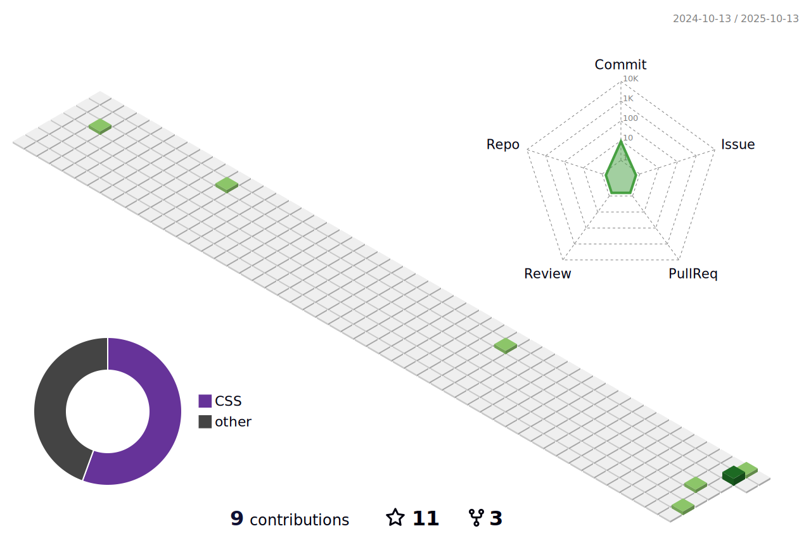

 

<h1 align="center">
  
</h1>

<h3 align="center">:technologist: About Me</h3>

- :round_pushpin: I'm a curious and ambitious high school student from Myanmar(Burma).
- :book: Thrilled to learn new things, particularly related to web developing & IT.
- You can call me Robert :smile:
- :muscle: ***အရေးတော်ပုံအောင်ရမည်!***:v:
- :muscle: ***THE SPRING REVOLUTION MUST WIN!***:v:

 

 <h3 align='center'>Currently Learning :</h3>

  
<!--Nothing, too busy to learn :cry: <!--img src=""-->

 

<h3 align='center'>My Workspace :computer:</h3>

   

 

  
:headphones: Spotify :musical_note:
 
    

    
    

  
:bar_chart: Github Statistics
 
  

    <!--img src="https://github-profile-summary-cards.vercel.app/api/cards/profile-details?username=NyanKaungSet&theme=vue"><br-->
     
    <b>*Note:</b><i> Top languages is just a metric of the languages and doesn't reflect experience or skill level.</i>  
    
     

  
:keyboard: Skills
 
  

      

  
:desktop_computer: Frameworks and Web Hosting
 
  

    <!--img src="https://img.shields.io/badge/jQuery-0769AD?style=for-the-badge&logo=jquery&logoColor=white"-->  

  
:trophy: Trophy
 
  

    
  

<!--details>
  
:iphone: Contact Me
 
  

    <strong>Currently Not Available ☹️ </strong>
  

<hr-->

  
😄 Random Jokes
 
  

    
  

  
:upside_down_face: Want to see my snake animation :snake: and 3D profile contribution?
 
  

    
    

  
:eyes: Want to see more details?
 
  

    
  

<h1 align="center">
  
</h1>
